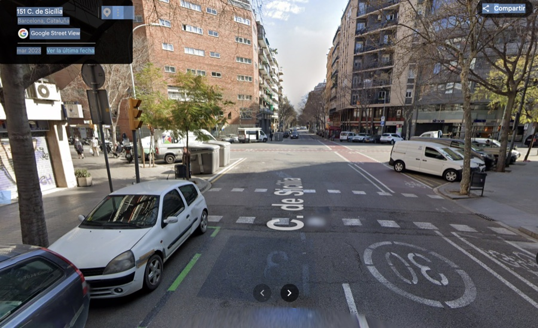
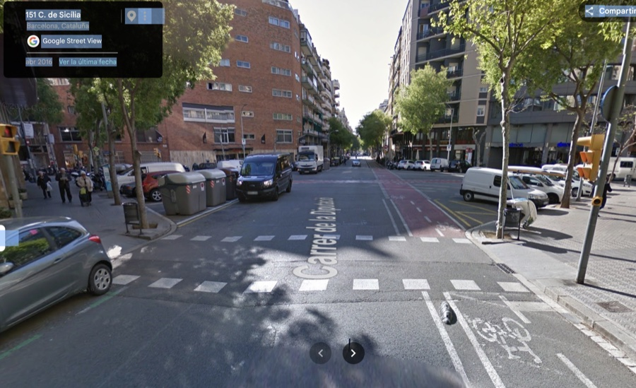
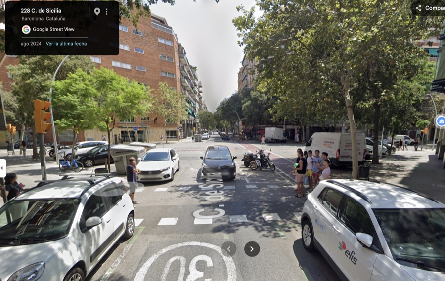
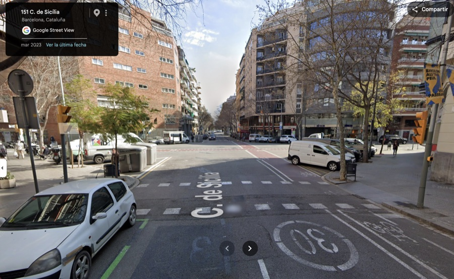
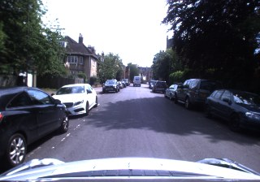
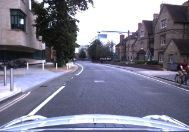
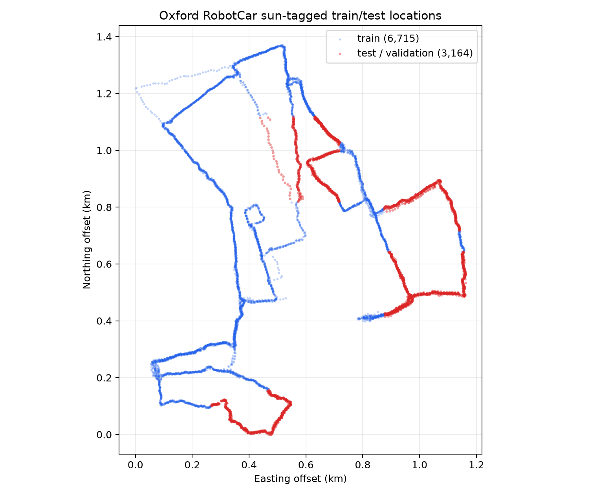
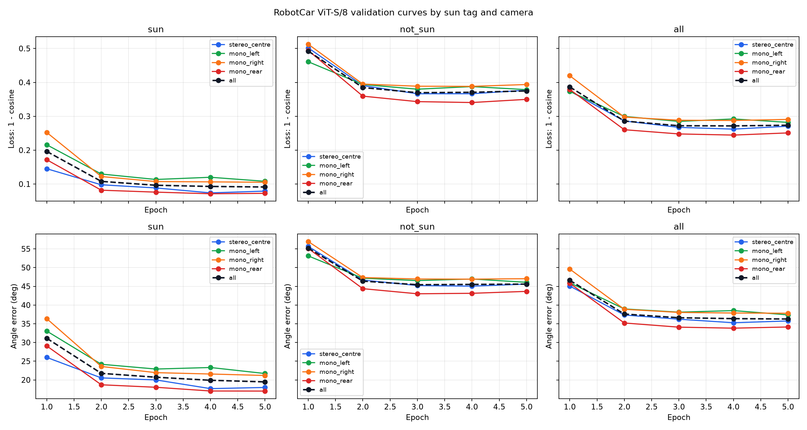
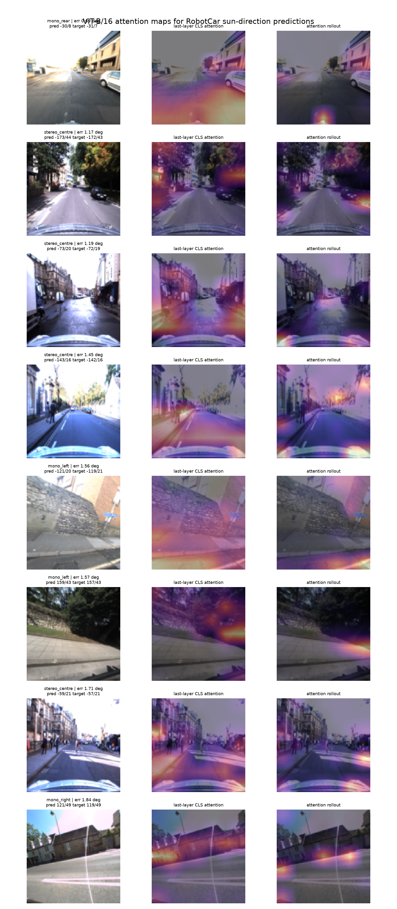
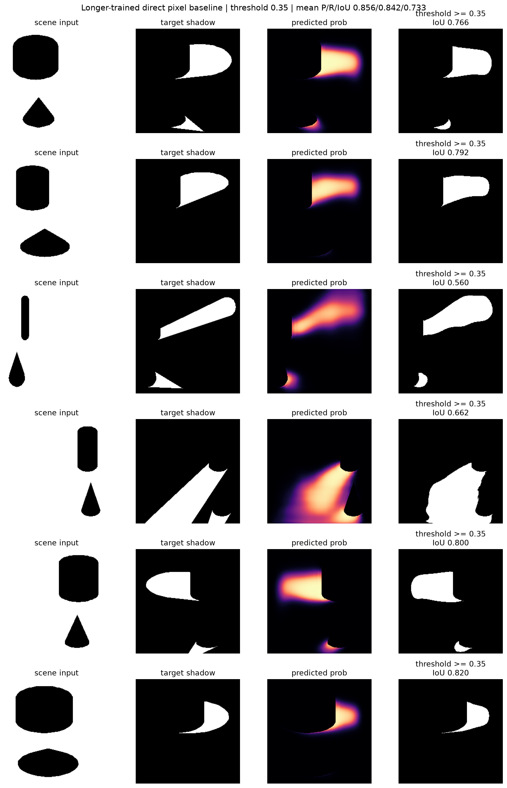

# Shadow Prediction

Given a street 3D scene, mostly coming from Street View style imagery or
captured by cars, we want to predict the shadows created by buildings, trees,
vehicles, and other objects in that scene under different sun positions. An
equivalent conditioning variable is a location plus a day of the year and time
of day, from which the sun position can be estimated.

This repository is a research sandbox for that problem. The intended final
mapping is:

```text
scene representation + sun position -> shadow mask or shadowed image
```

## Motivating Example

These Google Street View images show the same place captured at different hours
or times of the year. The static scene layout is largely the same, but the
visible shadows move and change shape as the sun position changes. This is the
kind of variation the project is trying to model.

<table>
  <tr>
    <td></td>
    <td></td>
  </tr>
  <tr>
    <td></td>
    <td></td>
  </tr>
</table>

The current codebase contains three related tracks:

- Synthetic shadow experiments, where we control scene geometry, light position,
  and rendered shadows.
- Oxford RobotCar experiments, where we use street images plus location and
  approximate vehicle heading to predict the sun direction.
- Latent transition and world-model prototypes, where the state is a shadowed
  scene and the action is a change in sun position.

## Current Focus

We start with a much simpler problem that can give us hope for the harder one:

```text
given a street image and the place where it was taken, can we predict the sun position?
```

For this we use the Oxford RobotCar dataset. It was collected by a car driving
around Oxford many times, across different days, seasons, weather conditions,
and times of day. The car has several cameras, so the dataset contains street
images from different viewing directions, plus location and timestamp metadata.
In the Kaggle archive used here, the main inputs are:

- RGB images from the car cameras: `stereo_centre`, `mono_left`, `mono_right`,
  and `mono_rear`.
- The car location, stored as `northing/easting`.
- The image timestamp.
- A rough car heading estimated from nearby location points.
- Run tags from the RobotCar SDK, including whether a run is marked as `sun`.

From the timestamp and location we can compute an approximate sun vector. The
learning problem is then:

```text
RGB image + location + heading + camera id -> sun direction
```

This is not shadow prediction yet. It is a test of whether the image contains
enough information about lighting and shadows for a model to recover where the
sun was. If this works, then it is more reasonable to try the harder problem:
taking a street scene and asking what its shadows should look like under a new
sun position.

Examples from the RobotCar data:

<table>
  <tr>
    <th>Sun-tagged run</th>
    <th>Non-sun run</th>
  </tr>
  <tr>
    <td></td>
    <td></td>
  </tr>
</table>

### Train/Test Split

For this problem we should not randomly split individual frames, because nearby
frames on the same street can look almost identical. The target evaluation is a
completely disjoint-street split: train and test should cover different streets
or road segments, not nearby frames from the same drive. For the RobotCar runs
we check the split on a map before trusting the validation numbers.

Blue points are train locations and red points are held-out validation/test
locations for the sun-tagged RobotCar subset:



### First Result

ViTs with fine patches work quite well here. At image size `112`, the
`vit_s_8_timm` model uses 8-pixel patches, so the image is represented as a
`14 x 14` patch grid. Below is the validation breakdown for that model, split by
sun-tagged runs, non-sun runs, and camera type:



Performance is much better on the images from sun-tagged runs than on non-sun
runs. This is a useful sign that the model is using visible lighting and shadow
cues in the scene to identify the sun position. It is not a perfect proof,
because non-sun runs also differ in weather and image distribution, but it is
the behaviour we would expect if shadows are carrying real signal.

We can look one step deeper by plotting the ViT attention scores. The examples
below are images where this model predicts the sun direction well, with angle
errors between about `0.69` and `1.84` degrees. The image is split into patches,
and the model has a special `CLS` token that gathers information from those
patches before the final prediction. A `CLS`-to-patch attention overlay shows
which image patches the final representation attends to.



The highest-attention patches from the direct `CLS` attention and the rollout
map are visually quite aligned with shadows in the images. Here, rollout means
the attention signal propagated across transformer layers, instead of looking
only at the final layer.

## Synthetic Shadow Playground

As a playground / middle step, we create a synthetic scene with concrete shadows
and project those shadows according to different light source positions. The
input is a simple shadow-free scene plus a 3D light position, and the target is
the shadow mask for that same scene under that light.

The model trained for this is `ShadowMaskPredictor`, a small U-Net in
`shadow_prediction/model_shadow_gen.py`. It does not reason about 3D geometry
explicitly. It learns a direct pixel-level mapping:

```text
shadow-free synthetic scene + light position -> shadow pixels
```

This gives us a controlled setup where we can test whether a network can learn
the relation between scene layout, light position, and shadow shape before
moving to real street scenes.



## Project Layout

```text
shadow_prediction/
├── shadow_prediction/
│   ├── dataset.py                    # Synthetic light-position dataset
│   ├── dataset_robotcar_sun.py        # RobotCar archive dataset
│   ├── dataset_shadow_gen.py          # Synthetic shadow-mask generation data
│   ├── dataset_shadow_transition.py   # Shadow transition/world-model data
│   ├── model.py                       # Original synthetic ResNet model
│   ├── model_robotcar_sun.py          # ResNet/ViT RobotCar sun predictor
│   ├── model_shadow_gen.py            # Shadow-mask generation baseline
│   ├── model_shadow_world.py          # Latent transition/world-model modules
│   └── robotcar_sun.py                # Sun-position and coordinate helpers
├── scripts/
│   ├── train.py                       # Original synthetic light predictor
│   ├── train_robotcar_sun.py          # RobotCar sun-direction training
│   ├── train_shadow_gen.py            # Direct shadow-mask predictor
│   ├── train_shadow_jepa.py           # Stage-1 latent predictor + SIGReg
│   ├── train_shadow_decoder.py        # Stage-2 latent decoder
│   ├── train_shadow_world.py          # Joint latent world-model prototype
│   ├── evaluate_robotcar_sun_by_camera_weather.py
│   ├── plot_robotcar_breakdown_curves.py
│   └── render_robotcar_vit_attention.py
├── assets/
├── outputs/
├── models_checkpoints/
└── requirements.txt
```

## Setup

```bash
python3 -m venv .venv
source .venv/bin/activate
pip install -r requirements.txt
```

The training scripts support CPU, CUDA, and Apple Silicon MPS. On this machine
the RobotCar experiments have mostly been run with `--device mps`.

## Data

### Synthetic Data

The synthetic experiments generate data on the fly. They do not need an
external dataset.

### Oxford RobotCar Archive

The RobotCar experiments expect the Kaggle-style archive with the structure used
by `shadow_prediction/dataset_robotcar_sun.py`. The default local path in code is:

```text
/Users/donguille/Downloads/archive.zip
```

You can pass a different archive explicitly:

```bash
--archive /path/to/archive.zip
```

The dataset uses:

- `train.csv` and `val.csv` from the archive.
- RGB images from `images_small/<camera>/`.
- `northing/easting` location coordinates.
- Image timestamps to estimate the sun vector.
- Approximate heading from neighbouring location samples.
- Optional RobotCar tags to filter `sun` runs.

## Coordinate Conventions

For RobotCar, the sun target is a unit 3D vector.

- Global frame: `[east, north, up]`.
- Car-relative frame: `[right, forward, up]`.

The default training target is the car-relative frame. Heading is estimated from
nearby GPS/UTM positions, so it is an approximation rather than a true
GPS/INS-calibrated camera pose.

## Main Commands

### Train the RobotCar Sun Predictor

Example ViT-S/8 run using all four cameras and a one-hot camera id:

```bash
python scripts/train_robotcar_sun.py \
  --archive /Users/donguille/Downloads/archive.zip \
  --camera all \
  --camera-ohe \
  --sun-runs-only \
  --backbone vit_s_8_timm \
  --pretrained \
  --image-size 112 \
  --epochs 8 \
  --batch-size 64 \
  --lr 1e-4 \
  --device mps \
  --plot-curves
```

Useful backbone options currently include:

```text
resnet18
vit_b_16
vit_s_8_timm
vit_b_8_timm
```

### Evaluate by Sun Tag and Camera

This evaluates saved checkpoints across `sun`, `not_sun`, and `all` validation
subsets, split by camera.

```bash
python scripts/plot_robotcar_breakdown_curves.py \
  --run-dir models_checkpoints/robotcar_sun_predictor_20260712_204926 \
  --backbone vit_s_8_timm \
  --image-size 112 \
  --device mps
```

Outputs:

```text
val_breakdown_by_condition_camera.csv
val_breakdown_by_condition_camera.png
```

### Render ViT Attention Maps

For a ViT checkpoint, render the best validation predictions and show patch
attention overlays and raw patch-score grids:

```bash
python scripts/render_robotcar_vit_attention.py \
  --checkpoint models_checkpoints/robotcar_sun_predictor_20260712_204926/checkpoint_step1680.pth \
  --output-dir outputs/robotcar_vit_s_8_attention_epoch4_good \
  --top-k 8 \
  --image-size 112 \
  --max-train 0 \
  --max-val 0 \
  --batch-size 128 \
  --backbone vit_s_8_timm \
  --device mps
```

For `vit_s_8_timm` at image size `112`, the attention grid is `14 x 14`.
For `vit_b_16` at image size `112`, the attention grid is `7 x 7`.

### Train the Synthetic Shadow Predictor

This trains the pixel-level U-Net baseline on generated synthetic scenes:

```bash
python scripts/train_shadow_gen.py
```

### Train Latent Shadow Models

Stage 1 trains the encoder and latent predictor only:

```text
encoder(scene_t) -> z_t
predictor(z_t, sun_{t+1} - sun_t) -> z_{t+1}_pred
loss = prediction loss + SIGReg anti-collapse regularization
```

```bash
python scripts/train_shadow_jepa.py
```

Stage 2 trains a separate decoder from frozen latents back to pixels:

```bash
python scripts/train_shadow_decoder.py
```

There is also a joint world-model prototype:

```bash
python scripts/train_shadow_world.py
```

## What the Current Results Mean

The RobotCar sun-direction model is currently an intermediate diagnostic, not a
finished shadow predictor. Good sun-direction performance suggests that the
model can extract illumination cues from real street images. Poor performance on
`not_sun` runs is expected when training only on sun-tagged examples, because
those scenes are effectively out of distribution for a shadow-based signal.

The next modeling step is to move from:

```text
image + location -> sun vector
```

to:

```text
scene representation + requested sun vector -> shadow mask or shadowed image
```

For real Street View style imagery, that likely requires some combination of
geometry, segmentation, depth, camera orientation, and explicit sun conditioning.

## Requirements

- Python 3.8+
- PyTorch
- torchvision
- timm
- NumPy
- Matplotlib
- SciPy
- tqdm
- Pillow
- kaggle, only for Kaggle download helpers

## License

MIT License. See `LICENSE` for details.
